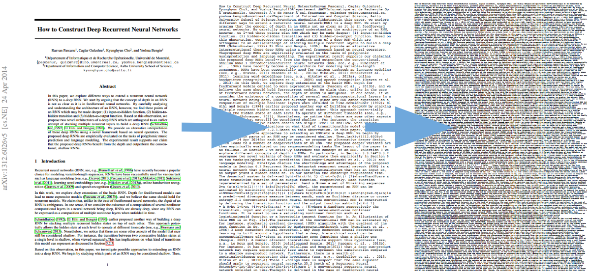

# pdf-compressor
Compress PDF file's pages and size.

## Introduction

A light-weight tool to compress PDF file's pages and size. The compressing loses origin file's format, only the text information is saved in the compressed result.

With default font size 10, the compressing effect looks like:
```bash
$ python main.py -i input.pdf
File size (KB):         15114.015----> 45.828
Page count:             23 --------> 15
```
By setting the font size smaller to 5:
```bash
$ python main.py -i input.pdf -f 5
File size (KB):         15114.015----> 31.638
Page count:             23 --------> 4
```

Below is a glance of the process, from left to right: origin file -> compressed file -> compressed file with font size 5.


## Requirements

In Python 3.X envrionment, install reqirements by `pip install -r requirements.txt`

## Usage
1. Clone the repository, put PDF file(s) to `./files` folder.
`python main.py -h` to check arguments' meanings. 
2. One typical usage command is:
    ```
    python main.py -i input.pdf
    ```
3. The output file is saved to `./files` folder with name ending `_compressed.pdf`

Below lists all arguments meaning:
```
'-b', '--base-path', default='./files', type=str, help='Base path to the PDF files for processing'
'-i', '--input-files', required=True, nargs='+', help="Input PDF files name(s), add space between two files"
'-f', '--font-size', default=10, help="Font size of the output PDF"
```

## Additions

- Open an issue if you meet problem, considering star the project if it helps. Thanks for your contributions!